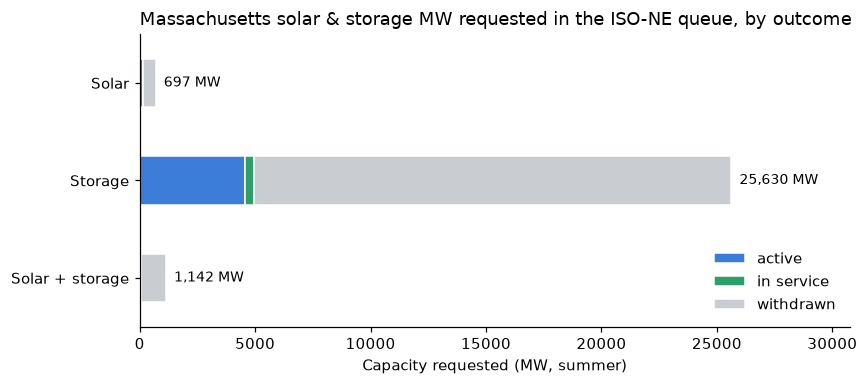
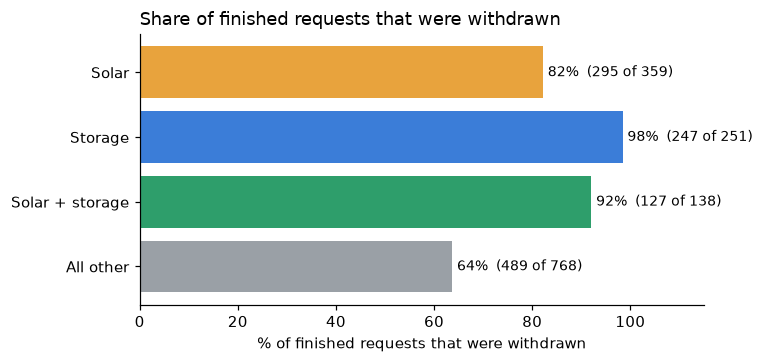

# ISO-NE Interconnection Queue: Solar + Storage Analysis

An analysis of ISO New England's public generator interconnection queue, looking at solar and
battery storage projects: how much capacity has been proposed in Massachusetts, how long projects
wait, how many get withdrawn, and how storage interest has grown.

## Summary of findings

The queue holds 1,751 interconnection requests going back to 1996; 1,569 are generators. Only
**53 generator requests are still active**. 1,158 have withdrawn, and 344 of those withdrew in 2025
alone, as ISO-NE moved from a first-come, first-served queue to cluster studies. In Massachusetts,
developers have requested **27,470 MW of solar and storage**, 93% of it (25,630 MW) standalone
battery storage. Yet only **574 MW (2%) is in service**, 22,325 MW (81%) was withdrawn, and all
4,571 MW still active is standalone storage. Attrition is the norm. Of requests that have finished
the process, **98% of storage, 92% of solar + storage and 82% of solar requests were withdrawn**,
compared with 64% for all other technologies. Solar projects that got built took a median of
**2.6 years** from request to commercial operation (hybrids 2.2 years). Withdrawn storage projects
usually quit early, at a median of 1.3 years. The projects still active have been waiting a median
of 4–5.6 years. Storage applications grew from 1 in 2015 to **91 in 2022** and stayed near 90 a
year through 2024.

| Chart | File |
|---|---|
| MA solar & storage MW by outcome | [`figures/q1_ma_capacity_by_status.png`](figures/q1_ma_capacity_by_status.png) |
| Median time in queue | [`figures/q2_time_in_queue.png`](figures/q2_time_in_queue.png) |
| Withdrawal rate | [`figures/q3_withdrawal_rate.png`](figures/q3_withdrawal_rate.png) |
| Storage requests by year | [`figures/q4_storage_requests_by_year.png`](figures/q4_storage_requests_by_year.png) |




## What this means for a solar + storage developer

- **Getting into the queue is easy; getting out the other side is not.** Nine in ten solar/storage
  requests never reach operation. Serious projects need early diligence on the point of
  interconnection, upgrade cost exposure and site control, so they aren't among the 90%.
- **Massachusetts storage is crowded.** More than 25 GW of standalone storage has been proposed in
  a state whose peak load is well under that. Projects compete for the same substations and upgrade
  headroom, so picking a less congested POI matters.
- **Plan for multi-year timelines.** Built solar projects took about 2.5 years from request to
  operation, and today's active projects have already waited 4–5.6 years. Financing, permitting and
  offtake schedules should assume delay.
- **Pairing storage with solar looks competitive.** Built hybrids reached operation slightly faster
  than standalone solar (2.2 vs 2.6 years median), though only 11 hybrids are in service so far.
- **The process just changed.** ISO-NE's switch to cluster studies (FERC Order 2023) drove a wave of
  withdrawals in 2025. New requests are now studied in batches, so the timing of cluster request
  windows and cost sharing within a cluster now shape a project's timeline. The old serial queue
  data in this report can't show how that works out yet.

## Data

| | |
|---|---|
| **Source** | ISO-NE Interconnection Request Tracking Tool (IRTT), public queue report: <https://irtt.iso-ne.com/reports/external> (linked from <https://www.iso-ne.com/system-planning/interconnection-service/interconnection-request-queue>) |
| **Downloaded** | 2026-09-30 (page shows "As of: 9/30/2026") |
| **Raw file** | [`data/raw/iso_ne_public_queue_2026-09-30.html`](data/raw/iso_ne_public_queue_2026-09-30.html) |
| **Clean file** | [`data/clean/iso_ne_queue_clean.csv`](data/clean/iso_ne_queue_clean.csv): 1,751 rows, one per request, ready for Tableau |

The report's "Export to Excel" button requires an ISO-NE login, so the raw file is the public web
page itself. It contains the same table. The notebook parses it directly.

**Key columns in the clean CSV**

| Column | Meaning |
|---|---|
| `queue_position` | ISO-NE's ID for the request (lower means earlier) |
| `status` | `active`, `in service`, or `withdrawn` (from ISO-NE codes A / C / W) |
| `fuel_group` | `Solar`, `Storage`, `Solar + storage`, or `All other` |
| `capacity_mw` | Summer MW (falls back to Net MW if blank) |
| `is_zero_net_request` | Net MW = 0: an add-on to an existing project; excluded from MW totals |
| `years_in_queue` | request → operation (in service), → withdrawal (withdrawn), → 2026-09-30 (active) |
| `is_massachusetts`, `is_generator` | filter flags |

Every cleaning decision is explained in the notebook's markdown cells.

**Limitations**

- Requests submitted through ISO-NE's new cluster request windows don't appear to be on this report
  (the latest request date is January 2025), so recent interest is undercounted.
- 142 withdrawn requests have no withdrawal date and are left out of the time-in-queue chart.
- Some groups are small: only 4 storage projects are in service, so their 6.8-year median is not
  reliable.
- Hybrid MW isn't split between solar and battery, because the queue reports one figure per project.

## How to run

Requires Python 3.10+.

```bash
git clone <this repo> && cd iso-ne-queue-analysis
python -m venv .venv
# Windows: .venv\Scripts\activate    macOS/Linux: source .venv/bin/activate
pip install -r requirements.txt
jupyter notebook notebooks/iso_ne_queue_analysis.ipynb
```

Run all cells (Kernel → Restart & Run All). The notebook reads the raw file, writes the clean CSV to
`data/clean/` and the four charts to `figures/`.

To use a newer copy of the queue, save the page from the source URL into `data/raw/`, then update
`RAW_FILE` and `AS_OF` in the setup cell.

## Repository layout

```
data/raw/      original queue page as downloaded
data/clean/    cleaned CSV (Tableau input)
notebooks/     iso_ne_queue_analysis.ipynb: cleaning + analysis
figures/       chart PNGs
```
